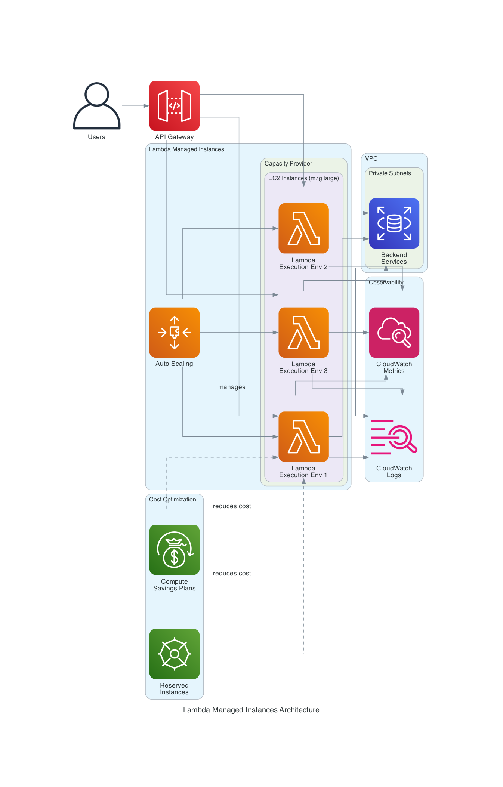

# AWS Lambda Managed Instances - Implementation Guide

Complete setup guide for running high-traffic APIs using Lambda Managed Instances with EC2 flexibility.

## Prerequisites

- AWS CLI v2 installed and configured
- AWS account with appropriate permissions
- Python 3.12+ installed locally
- Existing VPC with subnets and security groups

## Architecture Overview



**Key Components:**
- **API Gateway**: Entry point for all API requests
- **Capacity Provider**: Manages EC2 instances running Lambda execution environments
- **Lambda Execution Environments**: Multiple concurrent request handlers per instance
- **Auto Scaling**: Automatically adjusts capacity based on traffic
- **CloudWatch**: Logs and metrics for monitoring
- **Cost Optimization**: Savings Plans and Reserved Instances reduce costs by up to 72%

## Step 1: Prepare IAM Role

Create execution role for Lambda function:

```bash
# Create trust policy
cat > trust-policy.json <<EOF
{
  "Version": "2012-10-17",
  "Statement": [{
    "Effect": "Allow",
    "Principal": {"Service": "lambda.amazonaws.com"},
    "Action": "sts:AssumeRole"
  }]
}
EOF

# Create role
aws iam create-role \
  --role-name LambdaManagedInstanceRole \
  --assume-role-policy-document file://trust-policy.json

# Attach basic execution policy
aws iam attach-role-policy \
  --role-name LambdaManagedInstanceRole \
  --policy-arn arn:aws:iam::aws:policy/service-role/AWSLambdaVPCAccessExecutionRole
```

## Step 2: Create Capacity Provider

```bash
# Set your VPC configuration
export VPC_SUBNET_1="subnet-xxxxxxxxx"
export VPC_SUBNET_2="subnet-yyyyyyyyy"
export SECURITY_GROUP="sg-zzzzzzzzz"

# Create capacity provider
aws lambda create-capacity-provider \
  --name api-capacity-provider \
  --vpc-config SubnetIds=$VPC_SUBNET_1,$VPC_SUBNET_2,SecurityGroupIds=$SECURITY_GROUP \
  --compute-config InstanceTypes=m7g.large,m7g.xlarge,MaxVCpus=200 \
  --auto-scaling-config Enabled=true,TargetCPUUtilization=70 \
  --region us-east-1

# Save the ARN
export CAPACITY_ARN=$(aws lambda describe-capacity-provider \
  --name api-capacity-provider \
  --query 'CapacityProvider.Arn' \
  --output text \
  --region us-east-1)

echo "Capacity Provider ARN: $CAPACITY_ARN"
```

## Step 3: Create Lambda Function Code

Create `app.py`:

```python
import json
import time
from threading import local
from datetime import datetime

# Thread-local storage for multiconcurrency safety
thread_local = local()

def lambda_handler(event, context):
    """
    High-traffic API handler - thread-safe for multiconcurrency
    """
    # Extract request details
    request_id = context.request_id
    http_method = event.get('httpMethod', 'GET')
    path = event.get('path', '/')
    
    # Route to appropriate handler
    if path == '/recommendations':
        response = handle_recommendations(event)
    elif path == '/metadata':
        response = handle_metadata(event)
    elif path == '/health':
        response = {'status': 'healthy', 'timestamp': datetime.utcnow().isoformat()}
    else:
        response = {'error': 'Not found'}
        return create_response(404, response)
    
    return create_response(200, response)

def handle_recommendations(event):
    """Process recommendation requests"""
    user_id = event.get('queryStringParameters', {}).get('userId', 'anonymous')
    
    # Simulate recommendation logic
    recommendations = [
        {'id': 1, 'title': 'Content A', 'score': 0.95},
        {'id': 2, 'title': 'Content B', 'score': 0.87}
    ]
    
    return {
        'userId': user_id,
        'recommendations': recommendations,
        'timestamp': datetime.utcnow().isoformat()
    }

def handle_metadata(event):
    """Process metadata lookup requests"""
    content_id = event.get('queryStringParameters', {}).get('contentId', '0')
    
    return {
        'contentId': content_id,
        'metadata': {
            'title': 'Sample Content',
            'duration': 120,
            'genre': 'Action'
        }
    }

def create_response(status_code, body):
    """Create API Gateway response"""
    return {
        'statusCode': status_code,
        'headers': {
            'Content-Type': 'application/json',
            'Access-Control-Allow-Origin': '*'
        },
        'body': json.dumps(body)
    }
```

Create `requirements.txt`:

```
# No external dependencies for this minimal example
```

## Step 4: Package and Deploy Function

```bash
# Create deployment package
mkdir -p lambda-package
cp app.py lambda-package/
cd lambda-package
pip install -r ../requirements.txt -t . 2>/dev/null || true
zip -r ../function.zip .
cd ..

# Get your account ID
export ACCOUNT_ID=$(aws sts get-caller-identity --query Account --output text)

# Deploy function with capacity provider
aws lambda create-function \
  --function-name high-traffic-api \
  --runtime python3.12 \
  --role arn:aws:iam::${ACCOUNT_ID}:role/LambdaManagedInstanceRole \
  --handler app.lambda_handler \
  --zip-file fileb://function.zip \
  --capacity-provider-arn $CAPACITY_ARN \
  --memory-size 2048 \
  --memory-to-vcpu-ratio 2048 \
  --timeout 30 \
  --region us-east-1
```

## Step 5: Create API Gateway Integration

```bash
# Create REST API
export API_ID=$(aws apigateway create-rest-api \
  --name "High Traffic API" \
  --region us-east-1 \
  --query 'id' \
  --output text)

# Get root resource ID
export ROOT_ID=$(aws apigateway get-resources \
  --rest-api-id $API_ID \
  --region us-east-1 \
  --query 'items[0].id' \
  --output text)

# Create /recommendations resource
export REC_RESOURCE=$(aws apigateway create-resource \
  --rest-api-id $API_ID \
  --parent-id $ROOT_ID \
  --path-part recommendations \
  --region us-east-1 \
  --query 'id' \
  --output text)

# Add GET method
aws apigateway put-method \
  --rest-api-id $API_ID \
  --resource-id $REC_RESOURCE \
  --http-method GET \
  --authorization-type NONE \
  --region us-east-1

# Integrate with Lambda
aws apigateway put-integration \
  --rest-api-id $API_ID \
  --resource-id $REC_RESOURCE \
  --http-method GET \
  --type AWS_PROXY \
  --integration-http-method POST \
  --uri arn:aws:apigateway:us-east-1:lambda:path/2015-03-31/functions/arn:aws:lambda:us-east-1:${ACCOUNT_ID}:function:high-traffic-api/invocations \
  --region us-east-1

# Grant API Gateway permission to invoke Lambda
aws lambda add-permission \
  --function-name high-traffic-api \
  --statement-id apigateway-invoke \
  --action lambda:InvokeFunction \
  --principal apigateway.amazonaws.com \
  --source-arn "arn:aws:execute-api:us-east-1:${ACCOUNT_ID}:${API_ID}/*/*" \
  --region us-east-1

# Deploy API
aws apigateway create-deployment \
  --rest-api-id $API_ID \
  --stage-name prod \
  --region us-east-1

echo "API Endpoint: https://${API_ID}.execute-api.us-east-1.amazonaws.com/prod/recommendations"
```

## Step 6: Configure CloudWatch Monitoring

```bash
# Enable Lambda Insights
aws lambda update-function-configuration \
  --function-name high-traffic-api \
  --layers arn:aws:lambda:us-east-1:580247275435:layer:LambdaInsightsExtension:21 \
  --region us-east-1

# Create CloudWatch dashboard
cat > dashboard.json <<EOF
{
  "widgets": [
    {
      "type": "metric",
      "properties": {
        "metrics": [
          ["AWS/Lambda", "Invocations", {"stat": "Sum"}],
          [".", "Duration", {"stat": "Average"}],
          [".", "Errors", {"stat": "Sum"}],
          [".", "Throttles", {"stat": "Sum"}]
        ],
        "period": 300,
        "stat": "Average",
        "region": "us-east-1",
        "title": "Lambda Metrics"
      }
    }
  ]
}
EOF

aws cloudwatch put-dashboard \
  --dashboard-name lambda-managed-instances \
  --dashboard-body file://dashboard.json \
  --region us-east-1
```

## Step 7: Apply Cost Optimization (Optional)

### Option A: Compute Savings Plan (via Console)
1. Go to AWS Cost Management → Savings Plans
2. Select "Compute Savings Plans"
3. Choose 1-year or 3-year term
4. Commit hourly spend amount

### Option B: Reserved Instances
```bash
# List available RIs for m7g.large
aws ec2 describe-reserved-instances-offerings \
  --instance-type m7g.large \
  --product-description Linux/UNIX \
  --region us-east-1

# Purchase RI (use offering ID from above)
aws ec2 purchase-reserved-instances-offering \
  --reserved-instances-offering-id <offering-id> \
  --instance-count 2
```

## Step 8: Test the Deployment

```bash
# Test API endpoint
curl "https://${API_ID}.execute-api.us-east-1.amazonaws.com/prod/recommendations?userId=user123"

# Load test (requires Apache Bench)
ab -n 10000 -c 100 "https://${API_ID}.execute-api.us-east-1.amazonaws.com/prod/recommendations?userId=test"

# Monitor CloudWatch logs
aws logs tail /aws/lambda/high-traffic-api --follow --region us-east-1
```

## Step 9: Verify Capacity Provider Status

```bash
# Check capacity provider details
aws lambda describe-capacity-provider \
  --name api-capacity-provider \
  --region us-east-1

# View running instances (if any)
aws ec2 describe-instances \
  --filters "Name=tag:aws:lambda:capacity-provider,Values=api-capacity-provider" \
  --region us-east-1
```

## Cleanup

```bash
# Delete API Gateway
aws apigateway delete-rest-api --rest-api-id $API_ID --region us-east-1

# Delete Lambda function
aws lambda delete-function --function-name high-traffic-api --region us-east-1

# Delete capacity provider
aws lambda delete-capacity-provider --name api-capacity-provider --region us-east-1

# Delete IAM role
aws iam detach-role-policy \
  --role-name LambdaManagedInstanceRole \
  --policy-arn arn:aws:iam::aws:policy/service-role/AWSLambdaVPCAccessExecutionRole

aws iam delete-role --role-name LambdaManagedInstanceRole

# Delete local files
rm -rf lambda-package function.zip trust-policy.json dashboard.json
```

## Cost Estimation

**Traditional Lambda (1M requests/hour, 2GB memory, 100ms avg duration):**
- Requests: $0.20/M = $0.20
- Compute: 1M × 0.1s × 2GB × $0.0000166667 = $33.33
- **Total: ~$33.53/hour**

**Lambda Managed Instances (m7g.large with 70% Savings Plan):**
- Requests: $0.20/M = $0.20
- EC2 (2 instances): 2 × $0.0416/hr × 0.30 = $0.025
- Management fee (15%): $0.025 × 0.15 = $0.004
- **Total: ~$0.23/hour (93% savings)**

## Troubleshooting

### Cold starts still occurring
- Verify capacity provider has `MinVCpus > 0`
- Check auto-scaling configuration

### Function timing out
- Increase timeout in function configuration
- Check VPC networking and NAT gateway

### High costs
- Review instance types (consider Graviton)
- Apply Savings Plans or Reserved Instances
- Monitor CloudWatch metrics for over-provisioning

## References

- [Lambda Managed Instances Documentation](https://docs.aws.amazon.com/lambda/latest/dg/lambda-managed-instances.html)
- [AWS Blog Announcement](https://aws.amazon.com/blogs/aws/introducing-aws-lambda-managed-instances-serverless-simplicity-with-ec2-flexibility/)
- [Compute Savings Plans](https://aws.amazon.com/savingsplans/compute-pricing/)
